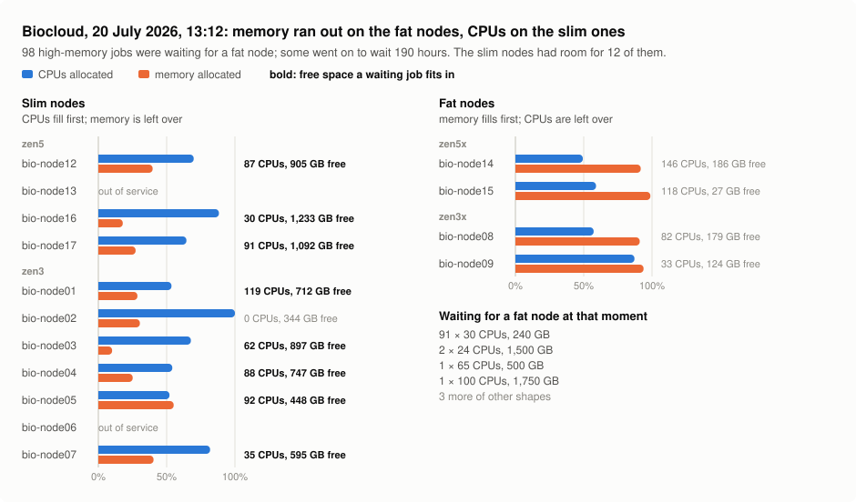

# slurmqueuepacker

A state-aware partition- and node-placement supplement for Slurm.

## The problem

When jobs share nodes, what a job needs is not just CPUs and memory but **memory per
CPU**. A node whose CPUs have been taken by low-memory jobs is left with memory that
no job can use, and a node whose memory has been taken is left with idle CPUs. So
clusters split their nodes into *slim* (little memory per CPU) and *fat* (a lot)
partitions and route each job by the memory per CPU it asks for. Users get that choice
wrong in both directions, so the routing is usually done for them at submission, by a
`job_submit.lua` rule that looks at nothing but that ratio.

Strict routing by ratio is right in the long run: it keeps each node's free space shaped
like the jobs that will come for it. But it cannot see what is running. Many jobs need
little memory, so slim nodes fill up on CPUs first, and what is left on them is mostly
memory: by then a slim node's free space has the memory per CPU of a fat job, and a
high-memory job would fit there. At the same moment the fat nodes run out of memory
with CPUs to spare, and the high-memory jobs queue for them.

<picture>
  <source media="(prefers-color-scheme: dark)" srcset="docs/img/mismatch-dark.svg">
  
</picture>

This is biocloud, as reconstructed from its accounting records. Since the current
partitions were introduced, 12,103 high-memory jobs (over 6 GB per CPU, one node) waited
more than an hour. At least 1,412 of them (12%) waited at a moment when every fat node was
too full for them and a slim node had room of their shape; that is 19,546 of the 92,471
hours those jobs spent waiting (21%). The figure and numbers come from
`tools/figure_mismatch.py`; nodes that ran no job for over 24 hours count as out of
service, and the count is a lower bound (see the script).

<details>
<summary>The figure as a table</summary>

| node | partition | CPUs allocated | memory allocated | free |
|---|---|---|---|---|
| bio-node12 | zen5 | 201 / 288 | 597 / 1,501 GB | 87 CPUs, 905 GB |
| bio-node13 | zen5 | out of service | | |
| bio-node16 | zen5 | 226 / 256 | 268 / 1,501 GB | 30 CPUs, 1,233 GB |
| bio-node17 | zen5 | 165 / 256 | 409 / 1,501 GB | 91 CPUs, 1,092 GB |
| bio-node01 | zen3 | 137 / 256 | 285 / 998 GB | 119 CPUs, 712 GB |
| bio-node02 | zen3 | 192 / 192 | 150 / 494 GB | 0 CPUs, 344 GB |
| bio-node03 | zen3 | 130 / 192 | 100 / 998 GB | 62 CPUs, 897 GB |
| bio-node04 | zen3 | 104 / 192 | 251 / 998 GB | 88 CPUs, 747 GB |
| bio-node05 | zen3 | 100 / 192 | 550 / 998 GB | 92 CPUs, 448 GB |
| bio-node06 | zen3 | out of service | | |
| bio-node07 | zen3 | 157 / 192 | 403 / 998 GB | 35 CPUs, 595 GB |
| bio-node14 | zen5x | 142 / 288 | 2,071 / 2,257 GB | 146 CPUs, 186 GB |
| bio-node15 | zen5x | 170 / 288 | 2,230 / 2,257 GB | 118 CPUs, 27 GB |
| bio-node08 | zen3x | 110 / 192 | 1,815 / 1,994 GB | 82 CPUs, 179 GB |
| bio-node09 | zen3x | 223 / 256 | 1,870 / 1,994 GB | 33 CPUs, 124 GB |

Waiting for a fat node: 91 jobs of 30 CPUs / 240 GB, 2 of 24 CPUs / 1,500 GB, and 5
others. The slim nodes had room for 12 of them at once.

</details>

## What sqp does

sqp keeps the ratio rule as the default and relaxes it when the cluster's current state
says a job fits elsewhere. At submission, from the cluster as it is right now, it decides:

- **which partitions a job may use**, by how well the job fits the free space in each,
  not by its ratio alone;
- **which node**, when the job can start at once: inside the highest-ranked partition
  (PriorityTier) with room, the node whose free space best matches the job: whose free
  memory per CPU is closest to what the job asks for, among the nodes that leave the most
  room usable by other jobs;
- **when to lift the per-user CPU caps**: for one minute at a time, when jobs held only
  by the caps would fit in hardware nobody else is using.

It does not replace the scheduler, reorder the queue or touch fair-share, and Slurm still
tries the allowed partitions in PriorityTier order. The decisions are made out of band by
a daemon, `sqpd`, which reads the cluster every second; the `job_submit.lua` plugin
applies them with one table lookup, because the plugin runs inside `slurmctld` and has
no view of cluster state itself. If sqpd stops, the plugin falls back to the static
ratio rule.

**Design document:** `docs/design.html`

## Status

**v<!-- x-release-please-start-version -->1.0.0<!-- x-release-please-end -->.** The daemon runs and the plugin is tested end to end against a real `slurmctld`
carrying biocloud's topology, including every failure path, node pinning and the release
of pins that did not start. Not yet run on a production
cluster; the next step is a dry run there (see [Dry run on a live cluster](#dry-run-on-a-live-cluster)).
Default mode is `observe`: compute and log every decision, change nothing.

## Installing

Needs Python 3.11+ (standard library only) and the Slurm commands `scontrol`, `squeue`
and `sacctmgr`. Run it on the `slurmctld` host. Tested on Slurm 26.05.

### Modes

sqp does only what its `mode` allows, whether you start it by hand or systemd does:

| mode | reads the cluster | chooses partitions (via the plugin) | pins nodes, releases pins | changes QOS limits |
|---|---|---|---|---|
| `observe` (default) | yes | no | no | no |
| `advise` | yes | yes | no | no |
| `enforce` | yes | yes | yes | yes |

In `observe` it runs only `scontrol show`, `squeue` and `sacctmgr show`, and logs what
it *would* do, as `enforce` would do it. Any other command is refused before a process is started, so this holds
even under a Slurm admin account. `--dry-run` is the same as `--mode observe`.

### Timing

All in `[cadence]`, in seconds:

| setting | default | what happens |
|---|---|---|
| `node_poll_interval` | 1 | reads nodes and partitions (`scontrol show`) |
| `queue_poll_interval` | 8 | reads the queue (`squeue`) |
| `score_interval` | 1 | rebuilds the placement table. It is rewritten when a decision changes, when free space changes (in `enforce`, for pinning), and at least every `policy_max_age / 3` (100 s) so the plugin never treats it as stale |
| `act_interval` | 15 | reconsiders the QOS caps. A pulse needs `[limits] hysteresis` (5) checks in a row, so at least 75 s, with jobs held by the caps that fit in idle hardware; it lasts `pulse_seconds` (60) and is followed by `cooldown_seconds` (300) at base |

And in `[pin]`: `max_age` (10 s), the oldest node data the plugin will pin from, and
`release_after` (60 s), how long a pinned job may stay pending before sqp removes the pin.

Placement happens only at submission, when the plugin reads the current table. Afterwards
sqp changes a job only to undo its own pin (see [Node pins](#node-pins)).

The caps it changes are `MaxTRESPU` and `MaxTRESPA` on an existing QOS, `[limits]
qos_name` (default `normal`); nothing needs creating. The `flex` QOS belongs to
`limits.mode = "perjob"`, which is not implemented yet.

**QOS caps are raised only in short pulses.** A user who submits a large pool of jobs
while the caps are raised can hold nodes for days, since jobs are not preempted, so the
caps stay at base (`base_cpu_per_user` 864, `base_cpu_per_account` 1760) almost all the
time. sqp raises both, for everyone, to `ceiling` times base (2x) only when all of these
hold for 5 checks in a row: at least 25% of the cluster is idle, and some pending job is
held only by the per-user or per-account CPU cap (`QOSMaxCpuPerUserLimit`,
`MaxCpuPerAccount`) and would fit in a node's free space. After 60 s, or as soon as the
cluster is less than 10% idle, the caps go back to base; then there are at least 5
minutes before the next pulse. Jobs that started during a pulse keep running; the user's
next jobs wait until they are back under the base cap. In `enforce`, sqp also puts the
caps back to base when it starts and when it stops, so a crash mid-pulse is undone by
the next start.

### 1. Install

<!-- x-release-please-start-version -->
```sh
sudo git clone --branch v1.0.0 https://github.com/kasperskytte/slurmqueuepacker /opt/slurmqueuepacker
cd /opt/slurmqueuepacker
python3 tests/test_policy.py                  # ends in ALL PASS
```
<!-- x-release-please-end -->

Run the `python3 -m sqp...` commands from this directory.

### 2. Dry run

```sh
python3 -m sqp.daemon --dry-run --state-dir ~/sqp-dry \
    --log-file ~/sqp-dry/decisions.jsonl --text-log ~/sqp-dry/sqp.log
```

It runs in the foreground until Ctrl-C. Follow it from another terminal with
`tail -f ~/sqp-dry/sqp.log`, which has one entry per job as it is submitted: where Slurm
put it, where sqp would have, and why. `python3 -m sqp.report ~/sqp-dry/decisions.jsonl --summary`
totals it up.

Check the first entry: the partitions sqp will use, and whether your QOS caps match
`[limits]` in the config. More in [Dry run on a live cluster](#dry-run-on-a-live-cluster).

### 3. Run it as a service (still `observe`)

```sh
sudo mkdir -p /etc/sqp
python3 -m sqp.daemon --print-config | sudo tee /etc/sqp/sqp.toml
sudo cp systemd/sqpd.service /etc/systemd/system/
sudo systemctl daemon-reload && sudo systemctl enable --now sqpd
```

The service runs in the mode set in `/etc/sqp/sqp.toml`, which is `observe` as
generated. It logs to `/var/log/sqp/sqp.log` (text) and `/var/log/sqp/decisions.jsonl`
(the same, as JSON). The defaults are biocloud's;
check `[limits]` (base caps must match the live QOS) and `[topology]` (partition speeds).

### 4. Go live

1. **Plugin.** `lua/job_submit.lua` replaces your `job_submit.lua` and carries biocloud's
   routing rules (GPU, interactive, Open OnDemand), so merge in your own and set the
   constants at the top of the file. Copy it next to `slurm.conf`, set
   `JobSubmitPlugins=lua` and run `scontrol reconfigure`. **This changes placement:**
   until sqp writes a table, the plugin applies its static `SLIM`/`FAT` rule.
2. **`advise`.** Set `mode = "advise"` and `sudo systemctl restart sqpd`. The plugin now
   uses sqp's table.
3. **`enforce`.** Set `mode = "enforce"` and restart. sqp now also pins nodes for jobs
   that can start at once, and pulses the QOS caps. Set `[pin] enabled = false` or
   `[limits] mode = "off"` to have one without the other.

### Upgrading

```sh
cd /opt/slurmqueuepacker && sudo git fetch --tags && sudo git checkout vX.Y.Z
sudo systemctl restart sqpd
```

If `lua/` changed (`sudo git diff --stat <old tag> vX.Y.Z -- lua/`), merge it into your
installed plugin and run `scontrol reconfigure`.

### Backing out

- **Instantly:** `sudo touch /etc/sqp/disable`. The plugin falls back to its static
  rule on the next submission, and sqp stops writing the table and raising the caps. It
  still ends a running pulse and releases pins that did not start, so nothing is left
  behind.
- **For good:** restore your old `job_submit.lua`, run `scontrol reconfigure`, then
  `sudo systemctl disable --now sqpd`.
- **Pins** on jobs still pending when sqp stops stay in place; those jobs wait for their
  node. Release them by hand:
  ```sh
  for j in $(squeue -h -t PD -o %i); do
    c=$(scontrol show job $j | grep -o 'AdminComment=sqp:pin=[^ ]*') || continue
    scontrol update jobid=$j reqnodelist= && scontrol update jobid=$j partition=${c##*from=}
  done
  ```
  Run it again if Slurm answers "Resource temporarily unavailable"; it is busy with the job.
- **QOS caps** are put back to base when sqp stops normally. If it was killed mid-pulse
  and you are not restarting it, reset them with
  `sudo sacctmgr -i modify qos normal set MaxTRESPU=cpu=864 MaxTRESPA=cpu=1760`,
  using your QOS name and base values.

## Releases

Versions and `CHANGELOG.md` are managed by
[release-please](https://github.com/googleapis/release-please). Write commits to `main`
as [Conventional Commits](https://www.conventionalcommits.org/): `fix:` makes a patch
release, `feat:` a minor one, and `feat!:` or a `BREAKING CHANGE:` footer a major one.
Other types (`chore:`, `docs:`, `test:`, ...) do not trigger a release. release-please
keeps a release PR open; merging it tags the release, publishes it on GitHub and bumps
the version in `sqp/__init__.py` and this README.

## Layout

```
sqp/
  config.py       every tunable, one TOML file, documented defaults
  policy.py       phi, scoring, bucket table, Lua rendering  (authoritative)
  slurm.py        scontrol/squeue/sacctmgr interface
  limits.py       the QOS cap pulse (+ an unused per-job promoter)
  daemon.py       the four-thread control loop
  narrate.py      decision records in words: the text log and the report
  report.py       reads the decision log back as a timeline and summary
lua/
  job_submit.lua  the plugin: one table lookup and an optional node pin; any failure falls back
etc/sqp.toml      example configuration
systemd/          unit file
tests/
  test_policy.py    behavioural tests for the placement core
  testcluster.sh    throwaway slurmctld with real topology, unprivileged
tools/
  dump2sqlite.py   mysqldump of the Slurm accounting DB -> standalone SQLite
  normalize.py     typed `jobs` + `jobstats` tables with derived columns
  analyze.py       workload characterisation (first pass)
  stranding.py     per-node occupancy reconstruction; stranded CPU-hours
  stranding2.py    breakdown by partition and by job footprint
  simulate.py      trace-driven replay of the queue against a placement policy
  figure_mismatch.py  the README figure and its numbers
docs/
  design.html      the design document
  img/             the README figure, light and dark
```

## Running the daemon

```sh
python3 -m sqp.daemon --print-config > /etc/sqp/sqp.toml   # all tunables, documented
python3 -m sqp.daemon -c /etc/sqp/sqp.toml --once          # one pass, table to stdout
python3 -m sqp.daemon -c /etc/sqp/sqp.toml --dry-run       # run, change nothing, log intent
python3 -m sqp.daemon -c /etc/sqp/sqp.toml                 # run
python3 -m sqp.report /var/log/sqp/decisions.jsonl         # read the decision log
python3 tests/test_policy.py                               # behavioural tests
```

### Node pins

When a job can start the moment it is submitted, the plugin also sets its node
(`--nodelist`). Slurm tries a job's partitions in PriorityTier order and starts it in the
first one with room, so the node is chosen inside that partition, never against the
tiers. Among the nodes there with room:

1. those that leave the most capacity usable by other jobs are the contenders: the best,
   and any within `[pin] min_gain` (one CPU's worth) of it. Capacity is measured against
   the mix of jobs the cluster actually runs (`[policy] demand`);
2. of those, the node whose free memory per CPU is closest to the job's wins.

That is how a high-memory job ends up in the memory a slim node has left. The capacity
measure already prefers matching shapes, but cannot tell nodes apart above the demand
mix's largest ratio, or between leftovers of similar shape; there the ratio decides. sqp
leaves the choice to Slurm when only one node has room, or when the winner is neither
`min_gain` better than the worst candidate by capacity nor `min_ratio_gain` (about 10%)
closer by memory per CPU.

Only plain jobs are pinned: one task (or several with `-N 1`), no `--nodelist`,
`--exclude`, `--constraint`, `--exclusive`, `--mem-per-cpu`, hold, begin time, array or
non-GPU GRES, and, with `[limits] mode = "global"`, only when the user has room under the
per-user CPU cap. A job with a dependency is pinned like any other; if the dependency
keeps it waiting, the pin is released like any other. The node's
partitions become the job's partitions, since Slurm rejects a node outside any listed
partition, and the plugin records `AdminComment=sqp:pin=<node>;from=<partitions>`.

A pinned job that is still pending after `[pin] release_after` (60 s), because the node
filled in the meantime, has the pin removed and its partitions restored. sqp only ever
touches jobs carrying its own mark; a user's own `--nodelist` is left alone.

### Why the plugin filters feasibility itself

The bucket table is indexed by (memory-per-CPU, CPUs, walltime), and its top buckets are
open-ended. A 24-CPU/2.2 TB job and a 24-CPU/0.86 TB job share a bucket, so a partition set
chosen for the smaller one can be handed to the larger, which none of its partitions can
hold. The daemon therefore emits each partition's largest node alongside the table, and the
plugin drops partitions that cannot hold the job — recomputing feasibility across all
partitions if the set it was given is unusable. Corrections are logged as `refit`.

### Testing the plugin without a cluster

`tests/testcluster.sh` starts a throwaway `slurmctld` as your own user on port 7817,
with the real node and partition topology and no `slurmd`. The nodes are declared as cloud
nodes that "power up" by running `/bin/true`, so a job that fits is really allocated a
node (it stays `CONFIGURING` and never runs) and one that does not stays `PENDING`. That
shows the partitions and node the plugin chose, and lets nodes fill up; `scancel` frees
them. Point `SLURM_CONF` at it for every command, or you will talk to your real cluster.

```sh
tests/testcluster.sh start
export SLURM_CONF=/tmp/sqp-cluster/slurm.conf
python3 -m sqp.daemon -c /tmp/sqp-cluster/sqp.toml &     # writes the policy table
sbatch -n 1 --mem=32G -t 10 --wrap='sleep 60'            # squeue -o '%P %N %n': partitions, node, pin
scontrol update nodename=bio-node[14-15] state=drain reason=test   # watch decisions change
tests/testcluster.sh stop
```

### Dry run on a live cluster

`--dry-run` (the same as `--mode observe`) runs the full loop against the real cluster
and changes nothing. The text log reads like this (from the test cluster):

```
2026-09-24 12:48:13  job 65 by kapper ("wrap"): 4 CPUs, 200 GB, 2 h -- submitted 12:48:09, starting on bio-node14
    partitions   Slurm ran it in zen5x; sqp would allow zen5   (sqp would not have allowed zen5x: a poorer fit for this job's shape)
    node         sqp would pin it to bio-node12 (partition zen5): 4 zen5 nodes could start it now; bio-node12 leaves the most room for other jobs (7.5 CPUs' worth more than the worst choice); Slurm chose bio-node14
```

`python3 -m sqp.report <decisions.jsonl>` prints the same text from the JSON log, with a
summary; `--summary` prints only the summary, `--only different,excluded` only the jobs
where sqp and Slurm disagree. In `advise` and `enforce` the entries say what sqp did
instead.

The JSON log has one record per line, each with `ts` and a readable `time`:

| event | what it records |
|---|---|
| `preflight` | what this run can change (`actuation`, `writes_table`), the partitions it will use, and whether the live QOS caps differ from `base_cpu_per_*` |
| `action` | every change sqpd would make: `action` (`write_policy_table`, `set_qos_cpu_limits`, `release_pin`), `cmd`, `why`, `executed`, and `blocked` (why it did not run). Table writes include the per-bucket `changes`; rewrites that only refresh free space are not logged |
| `placement` | each job first seen in the queue: where Slurm put it (`actual`, `node`), where the plugin would have (`would`), the partitions the two disagree on and why (`differences`), the node sqp would pin (`pin`, `pin_why`), and a `verdict` (`same`/`different` for pending jobs, `allowed`/`excluded` for running ones). In `advise`/`enforce`, `sqp_pin` is the pin the plugin actually set |
| `policy`, `limits` | aggregate state at each table or cap change |
| `error` | each distinct poll or scoring failure, once |

The table it would have written goes to `<state_dir>/policy.dryrun.lua`, not the path the
plugin reads. Cap pulses run against a simulated cap, as if every earlier change had
been applied.

Nothing in a dry run depends on the account's Slurm permissions. Three guards, each
enough on its own:

1. Each action checks the mode before it is attempted.
2. Every state-changing command goes through `slurm.apply()`, which runs nothing
   unless the daemon was started in `enforce` mode.
3. Every process sqp starts goes through one function, which outside `enforce` mode
   refuses anything but `scontrol show`, `squeue` and `sacctmgr show`.

The tests check each guard (sections 10 and 10b of `tests/test_policy.py`).

Caveats. A job is evaluated when it is first polled (up to `queue_poll_interval` after
submission), against the cluster as it is then; for a job that has already started, its
own allocation is added back first. Jobs that start and finish between two polls are not
seen. Jobs present when the daemon starts are not evaluated; `--once` evaluates every job
currently queued. A dry run does not pin jobs of several tasks, because `squeue` cannot
show whether they are limited to one node; the plugin pins those with `-N 1`.

Creating the `disable_file` reverts to the site's static rule on the next submission,
with no restart. If the daemon dies, the table goes stale past `policy_max_age` and the
plugin falls through to the same static rule — degrading to today's behaviour, not to an
outage.

Partitions are discovered from `scontrol show partitions` unless `batch_partitions`
lists them. Either way, three exclusions apply, each overridable in `[topology]`:
`exclude_partitions` (by name, empty by default), `exclude_interactive` (drops any
partition named `interactive`, on by default) and `exclude_gpu_nodes` (ignores nodes whose
`Gres` or `CfgTRES` has a GPU, on by default; a partition left with no nodes is dropped).
The `preflight` log record lists what was kept, what was excluded and why.

Everything is tunable in `sqp.toml`: cadence, demand mix, bucket edges, tolerance,
starvation budgets, limit ceilings and thresholds, cohort keys. Nothing in the daemon
reads a magic number directly.

## Getting the data in

The accounting dump is read directly; it is never restored over a live database
(the dump contains `DROP TABLE` / `CREATE DATABASE slurm_acct_db`). The dump and the
SQLite files derived from it hold user and job records and are kept out of git
(`.gitignore`).

```sh
bzcat slurm_acct_db_backup.bz2 > dump.sql
python3 tools/dump2sqlite.py dump.sql biocloud.sqlite --cluster biocloud
python3 tools/normalize.py biocloud.sqlite
```

`dump2sqlite.py` takes ~30 min on a 5.7 GB dump; `normalize.py` ~4 min.

## Replaying the queue

```sh
python3 tools/simulate.py --start 2026-03-09 --days 14 --warmup 4
```

Replays the real arrival trace — eligible time, shape, recorded runtime, recorded
priority — against each placement policy in turn, and prints work completed, stranded
CPU-hours and wait-time distributions. Policies:

| policy | what it does |
|---|---|
| `actual` | replays the partitions Slurm really assigned (fidelity reference) |
| `static` | reproduces the current `job_submit.lua` rule |
| `feasible` | any partition with a node physically big enough for the job |
| `packer` | gates the feasible set by option-value cost (see the design doc) |

Each policy is replayed twice: with backfill reservation horizons taken from **declared time
limits** (what Slurm does) and from **cohort-p95 history** (`predicted`).

### Units

The unit is the **allocation-hour**, for CPU and for memory. Allocation is what denies hardware
to other people; whether a job uses what it holds is not scored, and job CPU efficiency is
deliberately not modelled. The one efficiency that is modelled is **time**: reservation horizons
can come from declared limits or from cohort history.

### Reading the output honestly

The simulator models a priority-ordered scheduler with per-node backfill reservations computed
from declared deadlines, and enforces `MaxTRESPU=cpu=864` / `MaxTRESPA=cpu=1760`. It does **not**
model fair-share priority decay, `bf_max_job_test`, node drains, or Slurm reservations. Against
recorded history it lands close under load (32,252 vs 28,585 job-hours in the busy window) and
badly off on a quiet cluster (491 vs 5,032). Every run prints the recorded figure for comparison.

**Comparisons between policies within one run are the usable output. Absolute numbers
are not calibrated.**

Multi-node jobs are 0.06% of the trace and are placed as single-node.
